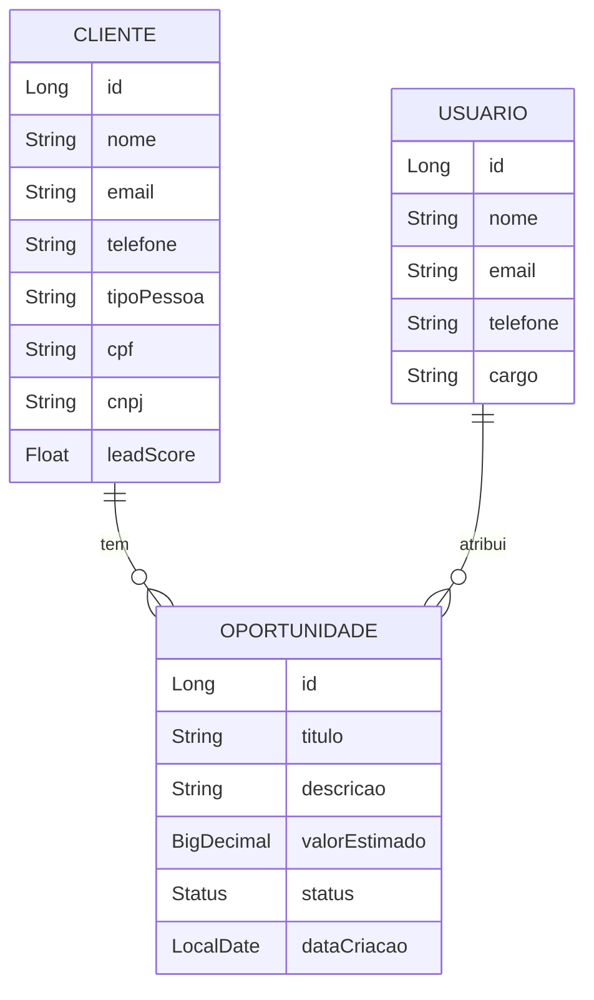

# 🤝 ConnectUs CRM - Sistema de Gestão de Oportunidades

<div align="center">
    
</div>

<br />

<div align="center">
  
  
  
  
</div>

---

## 1. Descrição

O **ConnectUs CRM** é um sistema de gestão de relacionamento com clientes focado em **oportunidades de vendas**. O projeto permite o controle completo de clientes, vendedores e oportunidades comerciais, com recursos como cadastro, busca filtrada, lead score, histórico e atualização de status de negócio (Nova, Em Negociação, Ganha, Perdida, Arquivada).

---

## 2. Funcionalidades

- Cadastro, busca, atualização e exclusão de clientes
- Cadastro e gerenciamento de oportunidades com status dinâmico
- Relacionamento entre clientes, usuários e oportunidades
- Filtro de clientes por nome, email, telefone, tipo e lead score
- Filtro de oportunidades por título e status
- Cadastro de usuários com funções de acesso
- Validações avançadas e controle de exceções
- Documentação de API via Swagger (OpenAPI)

---

## 3. Diagrama Entidade-Relacionamento (ERD)



---

## 4. Tecnologias Utilizadas

| Item                          | Descrição                         |
|-------------------------------|-----------------------------------|
| **Servidor**                  | Apache Tomcat (Spring Boot)       |
| **Linguagem**                 | Java 17                           |
| **Framework**                 | Spring Boot 3.x                   |
| **ORM**                       | Spring Data JPA / Hibernate       |
| **Banco de Dados**            | MySQL / H2                        |
| **Validação**                 | Bean Validation / Hibernate       |
| **Documentação**              | Swagger / OpenAPI                 |
| **Testes**                    | Insomnia / Postman                |

---

## 5. Como Executar o Projeto

```bash
# 1. Clone o repositório:
git clone https://github.com/Grupo-02-Turma-Java-82/Connectus_CRM.git

# 2. Abra na IDE (VSCode, IntelliJ, Eclipse ou STS)

# 3. Configure o banco de dados no application.properties

# 4. Rode a aplicação:
./mvnw spring-boot:run
```

---

## 6. Integrantes


| Nome                | GitHub                                           | Função                 |
|---------------------|--------------------------------------------------|------------------------|
| Bruno Godoy         | [Brunogodoy2911](https://github.com/Brunogodoy2911) | Dev/Tester         |
| Felipe Peronica     | [feperonica](https://github.com/feperonica)     | Scrum Master, Dev      |
| Jovani de Souza     | [JovaniOUnico](https://github.com/JovaniOUnico) | Dev/Tester             |
| Lívia D’Alexandri   | [liviadalexandri](https://github.com/liviadalexandri) | Dev               |
| Luiza Gonçalves     | [luizaeg](https://github.com/luizaeg)           | Tester                 |
| Maria Helena        | [squarcinihelena](https://github.com/squarcinihelena) | Dev               |
| Rafaela Giometti    | [rafagiometti](https://github.com/rafagiometti) | Dev                    |

---

## 7. Status do Projeto

🟡 Em desenvolvimento com funcionalidades principais concluídas e documentação técnica em andamento.

---

